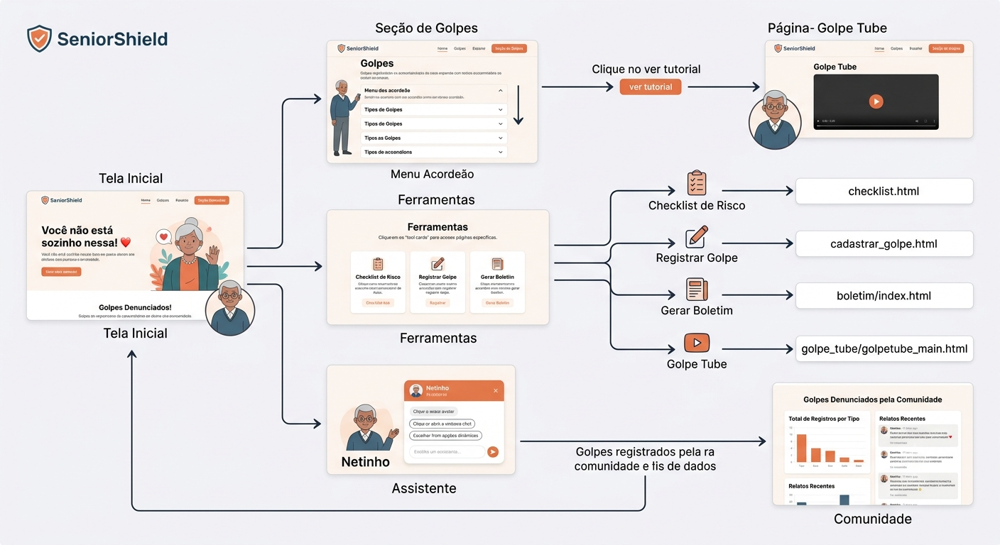

# Projeto de Interface

Pré-requisitos: <a href="2-Especificação.md"> Documentação de Especificação</a>

Para o planejamento e concepção da interface do **SeniorShield**, utilizamos a inteligência artificial Gemini e Canvas como ferramentas de apoio no processo criativo. 

O foco principal do desenvolvimento foi a **acessibilidade e a usabilidade prática**, projetando telas limpas, botões intuitivos e caminhos diretos que respeitam as necessidades e possíveis limitações tecnológicas do público da terceira idade. 

> **Nota sobre o Design:** 
> * Embora os protótipos já apresentem cores para melhor visualização dos elementos, a paleta atual é temporária e passará por refinamentos. 
> * Como o projeto evolui durante o desenvolvimento de software, a versão final programada pode apresentar pequenas variações funcionais ou visuais em relação aos wireframes iniciais aqui apresentados.

---

## User Flow

O fluxo de usuário abaixo ilustra a jornada simplificada do idoso ou de seu cuidador através das páginas e ferramentas da nossa plataforma:

---

## Wireframes

Abaixo estão os protótipos de média fidelidade estruturados para cada uma das páginas do sistema, priorizando o minimalismo e a clareza visual:

* [Acesse aqui o arquivo completo dos Wireframes (PDF)](<../../Downloads/Senior Shield V3.pdf>)