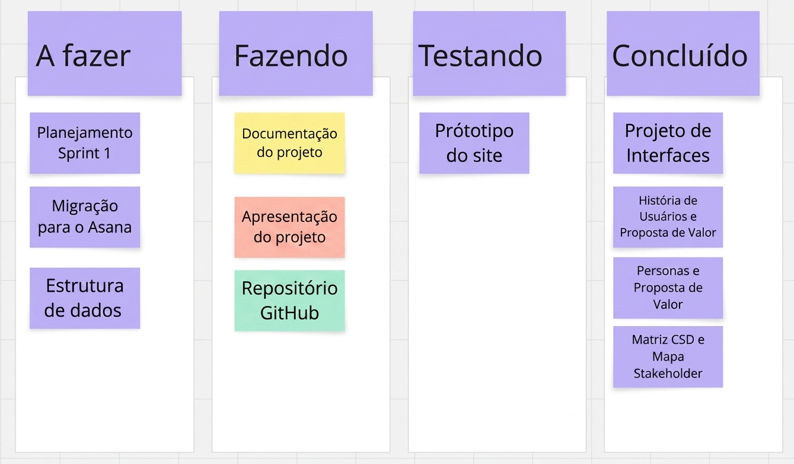

# Gerenciamento de Projeto

O gerenciamento de tarefas e a execução do cronograma do **SeniorShield** foram adaptados conforme a evolução da equipe. Durante a **Sprint 2**, o grupo sofreu uma redução de desfalques severa, com o desligamento do integrante Arthur Valente e o afastamento médico por incapacidade temporária do integrante Pedro Siqueira. Diante disso, a carga de implementação prática foi distribuída entre os membros presentes, que participaram colaborativamente de todas as frentes de desenvolvimento.

## Divisão de Papéis

Abaixo está a distribuição oficial de responsabilidades do projeto, destacando a liderança em gestão e documentação por parte da integrante Ilone Moreira e a colaboração geral no desenvolvimento de software:

### Sprint 1
*   **Scrum Master:** Ilone Moreira
*   **Documentação de Contexto e Especificações:** Ilone Moreira
*   **Desenvolvimento de Software (Front-end/Protótipos):** Glenda Magalhães, Vinícius Matosinhos, Pedro Siqueira e Arthur Valente

### Sprint 2
*   **Scrum Master:** Ilone Moreira
*   **Documentação e Engenharia de Requisitos:** Ilone Moreira
*   **Desenvolvimento de Software (Implementação e Integração):** Glenda Magalhães e Vinícius Matosinhos
*   **Membros Desligados/Afastados:** Arthur Valente (Removido do grupo) e Pedro Siqueira (Incapacitado por Licença Médica)

---

## Quadro de Tarefas

A organização visual das demandas e o progresso das atividades da equipe estão centralizados no quadro Kanban a seguir:

### Legenda de Atribuição por Cores:
*   💛 **Amarelo:** Pedro Siqueira
*   ❤️ **Vermelho:** Glenda Magalhães
*   💚 **Verde:** Ilone Moreira

(não utilizamos na sprint 2, feito no miro)