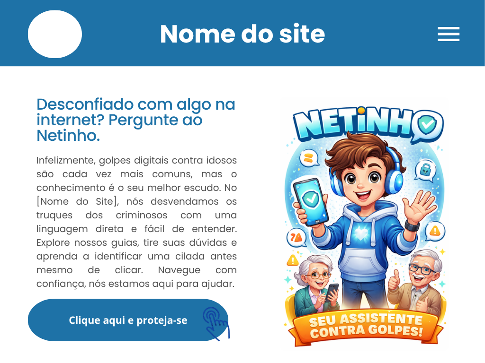
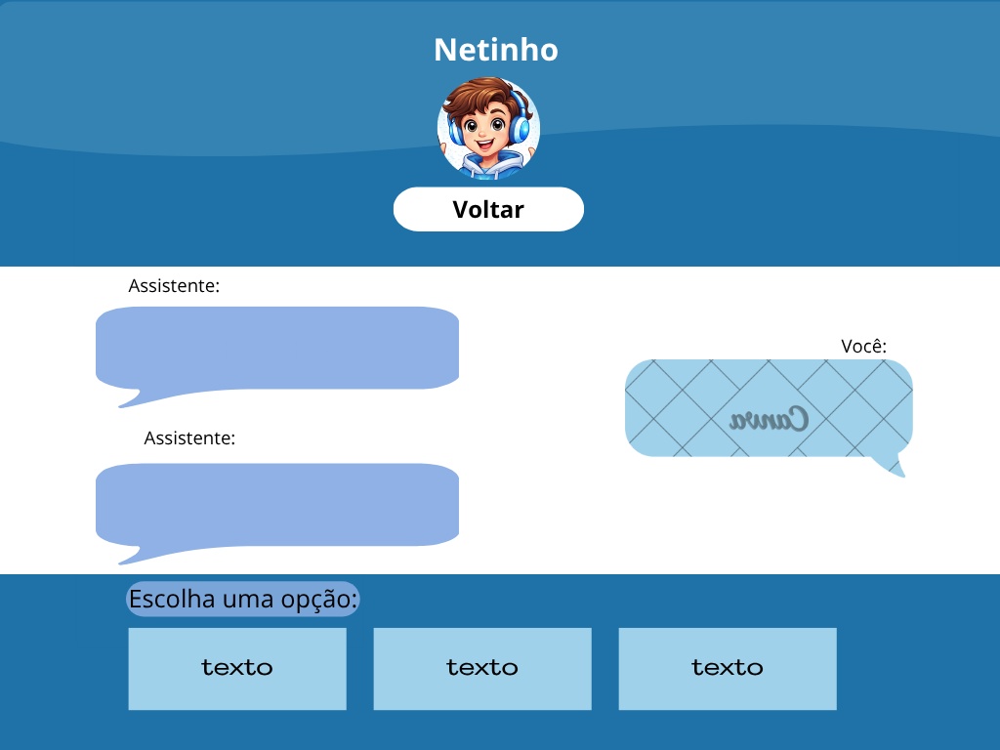
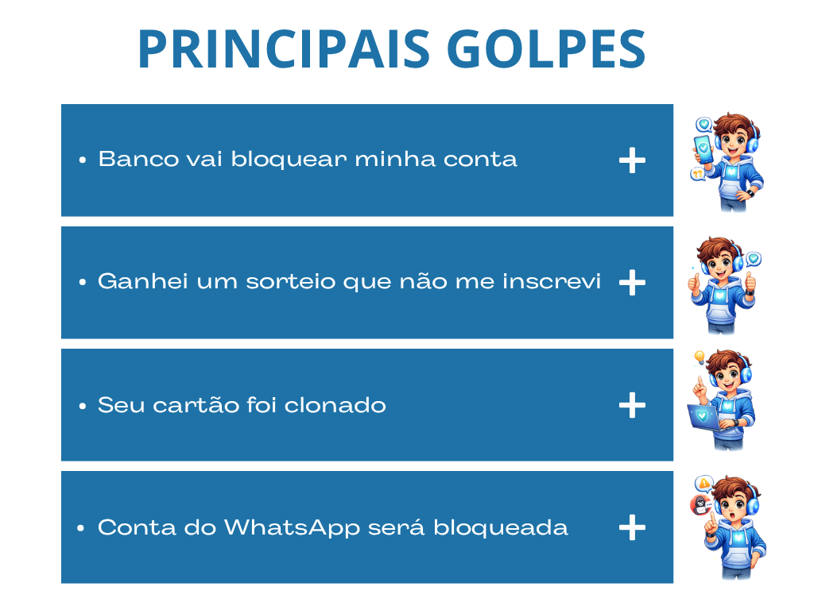
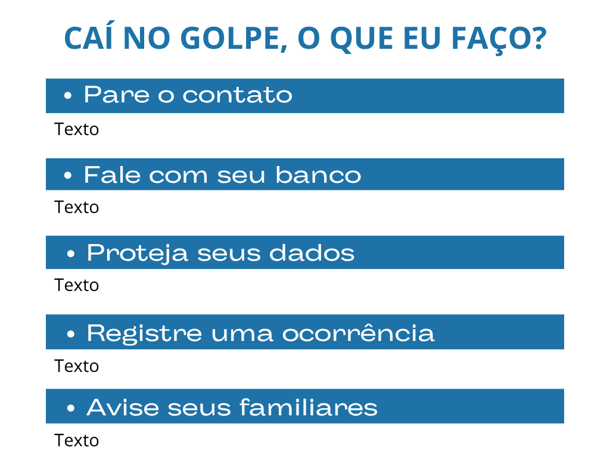

# Projeto da Solução

Pré-requisitos: <a href="4-Gestão-Configuração.md"> Ambiente e Ferramentas de Trabalho</a>

## Tecnologias Utilizadas

> Descreva aqui qual(is) tecnologias você vai usar para resolver o seu
> problema, ou seja, implementar a sua solução. Liste todas as
> tecnologias envolvidas, linguagens a serem utilizadas, serviços web,
> frameworks, bibliotecas, IDEs de desenvolvimento, e ferramentas.
> Apresente também uma figura explicando como as tecnologias estão
> relacionadas ou como uma interação do usuário com o sistema vai ser
> conduzida, por onde ela passa até retornar uma resposta ao usuário.
> 
> Inclua os diagramas de User Flow, esboços criados pelo grupo
> (stoyboards), além dos protótipos de telas (wireframes). Descreva cada
> item textualmente comentando e complementando o que está apresentado
> nas imagens.

>wireframe:<

>Descrição do Wireframe<
O wireframe apresenta a interface de um aplicativo móvel focado em comunicação ou suporte.
Tela Inicial/Conteúdo: Exibe um bloco de texto explicativo com uma ilustração ou avatar ao final.
Tela de Chat: Interface de mensagens com balões de fala (diálogo entre usuário e sistema/atendente) e campo de entrada de texto com botões de ação rápida.
Listagens de Conteúdo: Duas telas estruturadas com listas verticais (cards), possivelmente para exibir "Grupos" ou "Tópicos de Ajuda", contendo títulos, descrições breves e pequenos ícones laterais.
## Arquitetura da solução

> Inclua um diagrama da solução e descreva os módulos e as tecnologias
> que fazem parte da solução. Discorra sobre o diagrama.

A imagem a seguir ilustra a o fluxo do usuário em nossa solução. Assim
que o usuário entra na plataforma, ele é apresentado à tela inicial. por ser um site voltado a idosos, optamos por não fazer ela de login. então, ele pode optar por ler as iformações clicando no botão destascado, ou usar o assistente virtual(que sera feito sem o uso de ia, sera um banco de perguntas e respostas ja pré definidos)

O fluxo sugere uma jornada de suporte ou aprendizado:
Entrada: O usuário lê uma introdução ou guia informativo na tela principal.
Interação: Ao acionar um comando, ele é direcionado para a Interface de Chat para tirar dúvidas ou interagir com um assistente.
Navegação por Categorias: A partir do menu ou links no texto, o usuário acessa a lista de Principais Grupos/Tópicos.
Detalhamento: Ao selecionar um item da lista, ele visualiza informações mais densas e estruturadas sobre o tema escolhido.

